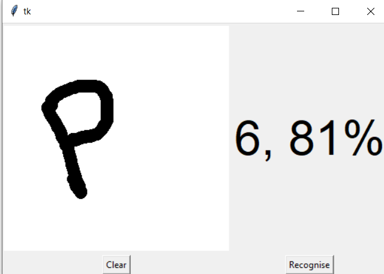
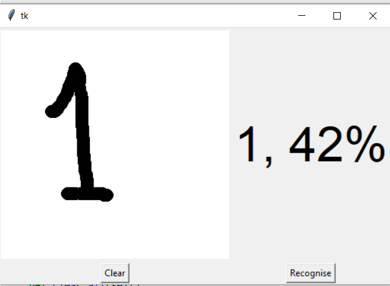

# _Handwritten digit recognizer_

## _What is Handwritten Digit Recognition?_  

&nbsp;

##### The handwritten digit recognition is the ability of computers to recognize human handwritten digits.

> The handwritten digit recognition is the ability of computers to recognize human handwritten digits. 
> It is a hard task for the machine because handwritten digits are not perfect and can be made with many different flavors. 
> The handwritten digit recognition is the solution to this problem which uses the image of a digit and recognizes the digit present in the image.

## _About the Python Deep Learning Project_  
> we are going to implement a handwritten digit recognition app using the MNIST dataset. 
> We will be using a special type of deep neural network that is Convolutional Neural Networks.
> In the end, we are going to build a GUI in which you can draw the digit and recognize it straight away.

## _Prerequisites_  
> The interesting Python project requires you to have basic knowledge of Python programming, deep learning with Keras library and the Tkinter library for building GUI.
> Install the necessary libraries for this project using this command:


```sh
pip install numpy tensorflow keras pillow
```

> The MNIST dataset
This is probably one of the most popular datasets among machine learning and deep learning enthusiasts.
> The MNIST dataset contains 60,000 training images of handwritten digits from zero to nine and 10,000 images for testing. So, the MNIST dataset has 10 different classes. The handwritten digits images are represented as a 28×28 matrix where each cell contains grayscale pixel value.

## _Libraries Required_ 

- Python 
- Tensorflow 
- Keras
- Numpy
- pillow

## _Usage_ 

1. Load the MNIST dataset file 

```sh
(x_train, y_train), (x_test, y_test) = mnist.load_data()
```


## _Tech_


- Django- Django is a high-level Python Web framework that encourages rapid development and clean, pragmatic design.
- Python - Import the libraries and load the dataset: Importing the necessary libraries​, packages, and MNIST dataset · 


### Below are the steps to implement the handwritten digit recognition project:


1. Import the libraries and load the dataset

2. Preprocess the data

3. Create the model

4. Train the model

5. Evaluate the model

6. Create GUI to predict digits


## Development


Pycharm uses for fast developing.
Make a change in your file and instantaneously see your updates!

## Execution 

Open your favorite Terminal and run these commands.

First :

```sh
Python train_digit_recognizer.py
```

Second :

```sh
python gui_digit_recognizer.py
```

## _ScreenShots_





